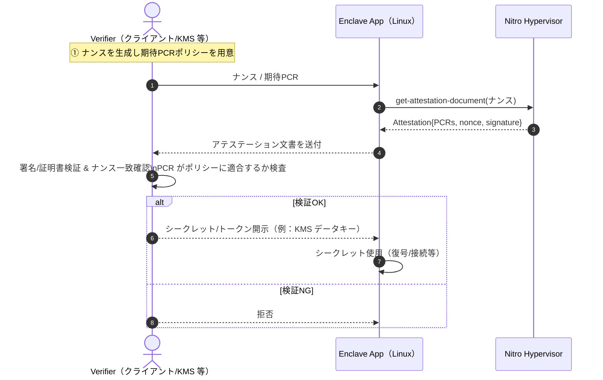

---
## 本記事はgithub管理に移行前の記事のためURL変更を避けるためslugは乱数のままです
title: "TEE（Trusted Execution Environment）入門[基礎編]"
emoji: "㊙️"
type: "idea"
topics:
  - "aws"
  - "ブロックチェーン"
  - "terraform"
  - "tee"
  - "enclaves"
published: true
published_at: "2025-09-17 17:47"
publication_name: "omakase"
---

本記事は、ブロックチェーン領域でも最近聞くことの多い **TEE（Trusted Execution Environment）** について解説していきます。  
**Part 2** では、ブロックチェーンにおける実用例の Automata 1RPC と Unichain（Flashblocks）について深掘りします。  
記述は 2025-09-16 時点の公知情報に基づきます。

## 1. TEE とは

TEE とは、**OS や root でもアクセス不可能なハードウェアレベルの隔離領域を作り、以下の処理を安全に行う仕組み**のことです。

1. 機密データの保管
2. 暗号演算や認証処理
3. 証明書付きの起動検証

Arm TrustZone、Intel SGX/TDX、AMD SEV-SNP など形式は色々ありますが、共通点は「**鍵を握るロジック＋メモリが常に暗号化され、ホスト OS からは覗けない**」ことです。

- TEE を使ってできること
  - CPU 内の隔離領域でコードとデータを実行・保持
  - **リモート・アテステーション**による**バイナリ測定値（ハッシュ）＋設定**の検証
  - 鍵・シークレットの安全な取り扱い（TEE 外へ生データを出さない前提設計）
    など。

- TEE では実現できない／気をつけること。
  - ハードウェア依存の脆弱性を**ゼロ**にはできない（サイドチャネル攻撃のリスク）
  - 正しさの根拠は**ハードウェア＋ファームウェアの信頼**に依存（暗号学的完結ではない）
  - 証明の粒度は「**このコードがこの設定で TEE 内にて走った**」まで（計算結果の**数学的完全性**は ZK の領域）
    などがあります。

ではどのような具体例があるのでしょうか。

---

## 2. スマートフォンの TEE（Secure Enclave / TrustZone）

もっとも身近な事例として、スマートフォンの生体認証が挙げられます。

- **iOS / Secure Enclave**
  - iPhone の Face ID／Touch ID テンプレートが入っている **Secure Enclave** は典型的な TEE の一種である。アプリケーションや OS から生体テンプレートなどの生データにはアクセス不可。
  - アプリケーションは `LAContext` などで **成功/失敗**のみ受け取る。

- **Android**
  - TrustZone/TEE で**生体データの取り扱いを分離**。
  - 認証可否のみがアプリケーション層へ渡る。テンプレートは TEE 領域で管理。

ポイントは**テンプレートや秘密鍵は TEE 外へ出さない**ことです。
アプリケーション設計では「**可否フラグ**」を前提に UX を組むことになり、パスワード認証などと比べても堅牢なセキュリティといえます。

---

## 3. AWS Nitro Enclaves 概要

では、TEE を使ったアプリケーション開発において有力候補の AWS Nitro Enclaves について簡単に紹介します。
※なお、AWS Nitro Enclaves は FHE 領域におけるリーディングカンパニーの [Zama ProtocolのKMS Nodeにも採用](https://docs.zama.ai/protocol/protocol/overview/kms#secure-execution-environments)されています。

AWS Nitro Enclaves とは EC2 インスタンス内に Enclave と呼ばれる分離されたアプリケーション環境を作成するための機能のことで、簡単に TEE を実装可能です。

### 3.1 前提知識

AWS Nitro Enclaves を設定したい場合、 EC2 インスタンスを作成する際のオプションにて Nitro Enclave を有効化するだけです。

- EC2（親）上に、**ネットワークなし／ストレージなし／SSH なし**の極小 OS（Linux）の **Enclave VM** を起動。
- データの**加工・復号・署名**など「見せたくない処理」をエンクレーブ内で完結。
- Enclave を利用することで、個人情報、医療、金融、知的財産データといった機密性の高いデータを保護および安全に処理可能。

### 3.2 要件と構成

- 親インスタンス：**Nitro ベース**、vCPU 要件あり（一般に 4 vCPU 以上、Graviton 系は別要件）
- 親 OS：**Linux / Windows Server 2012 R2+**
- エンクレーブ OS：**Linux のみ**
- 通信：**vsock**（親⇔エンクレーブのみ）

### 3.3 Nitro Enclaves アーキテクチャ

AWS Nitro Enclaves では、EC2 Instance と Nitro Enclave 間の疎通を vsock という通信のみで行います。


### 3.4 アテステーションとは

それでは、データの**加工・復号・署名**など「見せたくない処理」をエンクレーブ内で完結できたということをどのように保障するのでしょうか？
外部サービスからすると、本当にエンクレーブ内のみで完結しているのかを直接知る方法はありません。

そのため、外部サービスが「このエンクレーブは期待したコード／設定で起動し、改ざんされていない」と判断できるようにする仕組みが必要です。
それが"アテステーション"です。
アテステーションはエンクレーブが"自らの正当性を証明し、外部サービスとの信頼を築く"ための仕組みといえます。

### 3.5 アテステーションの流れ

では具体的なアテステーションの流れをみていきましょう。

1. Nitro Hypervisor が署名付きアテステーション文書をエンクレーブ内からの要求に応じて生成
2. 文書には PCR（Platform Configuration Register）等の測定値を含む
3. Verifier（KMS など）が文書の署名・ナンス・PCR 適合を検証
4. 条件を満たせば、Verifier が KMS の場合は Decrypt/GenerateDataKey/GenerateRandom などの結果を文書内の公開鍵で暗号化して返すため、平文はエンクレーブ外へ出ない

※ PCR (Platform Configuration Register)」とは、プラットフォーム構成レジスタといい、enclave に固有な暗号化測定値です。基本的に PCR は enclave の作成時に自動的に生成され、作成後 enclave に変更が加えられていないことを外部から検証できるようにするためのものです。



※ 代表的な PCR（短縮版）

| PCR  | 内容（要約）                     |
| ---- | -------------------------------- |
| PCR0 | Enclave Image のハッシュ         |
| PCR1 | Linux カーネル／ブートストラップ |
| PCR2 | アプリケーション                 |
| PCR3 | 親の IAM ロール                  |
| PCR4 | 親のインスタンス ID              |
| PCR8 | EIF 署名証明書                   |

---

### 3.6 単体 EC2 で Nitro Enclaves を有効化（最小構成）するterraform例

弊社 Omakase はブロックチェーンバリデータ運用を事業の軸としており、原則すべてのインフラを IaC で管理しています。以下我々が terraform で実装する場合の参考を紹介します。

```hcl

# ------------------------------------------------------------
# EC2（親）— Nitro Enclaves を有効化
# 例：m6i.xlarge は 4 vCPU（Intel/AMD 系は 4 vCPU 以上が目安）
# ------------------------------------------------------------
resource "aws_instance" "enclave_parent" {
  ami                    = data.aws_ami.al2.id
  instance_type          = "m6i.xlarge"
  subnet_id              = var.subnet_id
  key_name               = var.key_name
  iam_instance_profile   = aws_iam_instance_profile.enclave_profile.name
  vpc_security_group_ids = [aws_security_group.enclave_sg.id]

  # Enclavesを有効化
  enclave_options { enabled = true }

  metadata_options {
    http_tokens = "required"
  }

  user_data = <<-EOF
    #!/bin/bash
    set -eux
    # Amazon Linux 2 向け：Nitro Enclaves CLI を導入
    amazon-linux-extras enable aws-nitro-enclaves-cli
    yum install -y aws-nitro-enclaves-cli
    systemctl enable --now nitro-enclaves-allocator.service

    # 利用ユーザを ne グループへ
    usermod -aG ne ec2-user || true

    # （任意）Enclaves用の CPU/メモリを予約
    cat >/etc/nitro_enclaves/allocator.yaml <<YAML
    cpu_count: 2
    memory_mib: 1024
    YAML
    systemctl restart nitro-enclaves-allocator.service
  EOF

  tags = { Name = "enclave-parent" }
}

```

### 3.7 EKS で Nitro Enclaves を有効化（最小構成）するterraform例

```hcl

# Launch Template（AMI は指定しない＝EKS 管理 AMI を使用）
resource "aws_launch_template" "enclave_lt" {
  name_prefix = "eks-enclave-lt-"

  # Enclavesを有効化
  enclave_options { enabled = true }

  metadata_options {
    http_tokens = "required"
  }

  # EKS 最適化 AMI（AL2）向け：ブートストラップ＋ Nitro Enclaves 導入
  user_data = base64encode(<<-EOF
    #!/bin/bash
    set -eux

    # 1) EKS ノードのブートストラップ（AL2の場合原則必須）
    /etc/eks/bootstrap.sh ${var.cluster_name}

    # 2) Nitro Enclaves CLI の導入（Amazon Linux 2 ベース）
    if command -v amazon-linux-extras >/dev/null 2>&1; then
      amazon-linux-extras enable aws-nitro-enclaves-cli || true
      yum install -y aws-nitro-enclaves-cli
    else
      # AL2023 等のAMIの場合
      dnf install -y aws-nitro-enclaves-cli || true
    fi

    systemctl enable --now nitro-enclaves-allocator.service

    # 3) ノード上のデフォルト割当（必要に応じて調整）
    cat >/etc/nitro_enclaves/allocator.yaml <<YAML
    cpu_count: 2
    memory_mib: 1024
    YAML
    systemctl restart nitro-enclaves-allocator.service

    # 4) 利用ユーザ
    usermod -aG ne ec2-user || true
  EOF
  )
}

# Node Group（インスタンスタイプは 4 vCPU 以上を推奨）
resource "aws_eks_node_group" "enclave_ng" {
  cluster_name    = var.cluster_name
  node_group_name = "enclave-ng"
  node_role_arn   = aws_iam_role.node_role.arn
  subnet_ids      = var.private_subnet_ids

  scaling_config {
    desired_size = var.desired
    min_size     = var.min_size
    max_size     = var.max_size
  }

  # 例：Intel/AMD 系
  instance_types = ["m6i.xlarge"]
  ami_type       = "AL2_x86_64"

  launch_template {
    id      = aws_launch_template.enclave_lt.id
    version = "$Latest"
  }

  update_config { max_unavailable = 1 }
  tags = { "eks/addon" = "nitro-enclaves" }
}

```

## まとめ

TEE のコアは「隔離（isolation）＋アテステーション（検証可能性）」です。OS/root からの分離を前提に、"このバイナリがこの設定で TEE 内にて動いた" を第三者に示せることが特徴です。注意として、TEE はハードウェア信頼に依存し、サイドチャネルをゼロにはできない点に注意が必要です。
なお、本文の Terraform 例は、単体 EC2／EKS ノードの両パターンで Nitro Enclaves を有効化する最小実装の雛形です。自環境ではインスタンスタイプ・vCPU・AMI（AL2/AL2023）・ユーザーデータのブートストラップ方式（bootstrap.sh / nodeadm）を調整してください。
次回 Part2 では、Automata 1RPC と Unichain（Flashblocks）を題材に、TEE がブロックチェーンでどう実用されているかを掘り下げます。

## 参考リンク（公開情報）

- iOS Secure Enclave の概観（解説記事）: <https://medium.com/better-programming/app-security-in-swift-keychain-biometrics-secure-enclave-3c6b2b2a2b6d>
- Remote Attestation（Confidential Computing Consortium）: <https://confidentialcomputing.io/posts/what-is-remote-attestation/>
- AWS Nitro Enclaves（概説・測定値）: <https://docs.ata.network/pom/attestation-module/machine-attestation/aws-nitro-enclaves>, <https://aws.amazon.com/jp/blogs/aws/aws-nitro-enclaves-isolated-ec2-environments-to-process-confidential-data/>
