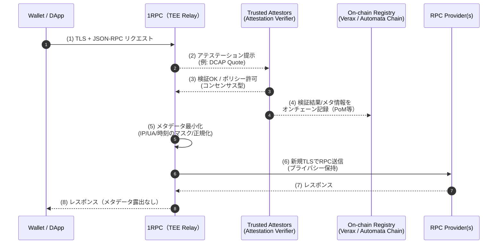
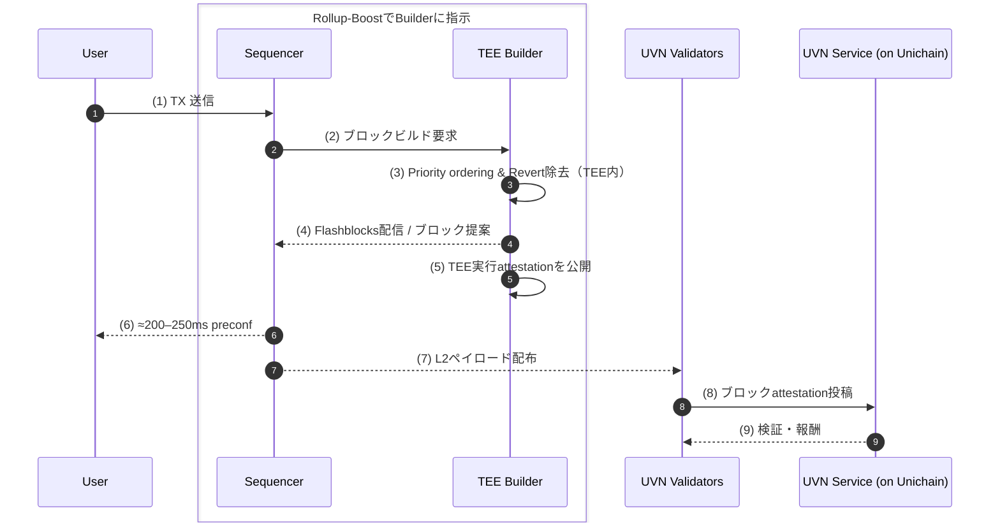

TEE とは、[前回のTEE（Trusted Execution Environment）入門[基礎編]で解説](https://zenn.dev/omakase/articles/afcd9b34500eec)したとおり、OS や root でもアクセス不可能なハードウェアレベルの隔離領域を作り、機密データの保管、暗号演算や認証処理、証明書付きの起動検証を安全に行う仕組みのことです。
今回の記事では、ブロックチェーンに応用した例として、**Automata 1RPC** と **Unichain（Rollup-Boost/Flashblocks）** について、その仕組みを解説します。

---

## 1. Automata 1RPC：プライバシー重視の RPC リレー

### 1.1 既存のRPCの役割と問題点

#### RPCの役割

ウォレットや dApp は、JSON-RPC を介してノード機能（eth_sendRawTransaction、eth_getBalance など）にアクセスします。多くのユーザーは自前ノードではなく、Infura/Alchemy/QuickNode 等の第三者 RPC の HTTPS エンドポイントへ接続します。このとき RPC 事業者は TLS 終端でリクエスト本文を復号するため、**送信元 IP・メソッド・パラメータ（ウォレットアドレス等）** を観測・処理し得ます。実際に一部の事業者は IP とウォレットアドレス情報を収集しているので要注意です。

#### 問題点：IPとウォレットアドレスの収集リスク

仮にハッカーに IP とアドレスが同一主体の下で紐付いて流出してしまうと、公開台帳上の残高・行動履歴と結合されてしまいます。ハッカーからすると、資産のあるウォレットを保有する IP アドレスを入手できることになるため、標的型フィッシングや DDoS/ドキシングなどの攻撃リスクが高まります。

#### 代替策の現実性：自前フルノード運用は障壁が高い

プライバシー観点では「自前ノード＋自前 RPC」が理想ではありますが、コスト・運用工数の面で、個人が運用するには現実的ではありません。

つまり、従来型の RPC は利便性の代償として IP やアドレスのメタデータ露出が避けにくく、自前運用はコストと SRE 難易度が高い――このギャップを埋めるために、**プライバシー重視の RPC リレー（Automata 1RPC）** の意義があります。

### 1.2 1RPC のアーキテクチャ

**Automata 1RPC とは、クライアントより送られた TX リクエストからメタデータ（IP/UA/時刻等）をフィルタリングしてRPC Providerにリクエストを受け渡すリレイヤーのことです。**

TX リクエストが RPC Provider に受け渡され、レスポンスがかえってくるまでの処理フローを以下に記載しました。

1. Wallet → 1RPC に接続
   クライアントは TLS で 1RPC に接続し、JSON-RPC を送ります。つまり、1RPC はクライアントと RPC providers の間に入る TEE プロキシです。

2. TEE がアテステーション提示
   1RPC の TEE は、ハードウェア／ソフトウェアの測定値（例：Intel DCAP の Quote など）を提示します。ここで「どのバイナリが、どんな設定で、どの TEE 上で動いているか」を示します。

3. Trusted Attestors が検証・許可
   **第三者の検証者集合（Trusted Attestors）** が、その測定値をポリシーに従って検証し、合否（許可／拒否）を TEE に返します。オンチェーンでのフル検証は高コストになりやすいため、まずオフチェーンで合意を取る段階です。

4. オンチェーン記録（PoM/レジストリ）
   検証結果や関連メタ情報は、オンチェーンのレジストリ（例：Verax、あるいは実装により Automata Chain 等）へ記録できます。これにより、第三者が後から検証可能になります。

5. TEE 内でメタデータ最小化
   IP / UA / タイミングなど、識別に使われやすい情報を TEE 内でマスク／正規化します。オペレータが保存しない、RPC providers にも渡さないことを前提に処理します。

6. TEE → RPC Provider に再 TLS で中継
   外部の RPC Provider(s) へは新しい TLS セッションでリクエストを転送します。プロバイダ側からは、最小化後の情報しか見えません。

7. Provider から TEE へ応答
   RPC Provider からのレスポンスを TEE が受け取ります。

8. TEE → Wallet へ返却（漏洩なし）
   受け取った結果をクライアントに返します。メタデータの露出は抑制されたままです。

このように、1RPC は TEE を使うことでユーザーのプライバシーを保護しています。

### 1.3 TEEの限界とRPCの今後

TEE はハードウェア起因のサイドチャネルの影響を受けるため万能ではありません。実際に SGX では Foreshadow（L1TF）によりエンクレーブ内の秘密が漏えいし得ること、SGAxe により Quoting Enclave からアテステーション秘密鍵が抽出され偽の Quote 署名まで可能になることが報告されています。これらは「TEE＝完全な機密保持」ではない事実を示します。
そのため運用面では、マイクロコード／BIOS／プラットフォーム・ファームウェアの継続的更新と、それに伴う TCB(Trusted Computing Base) の再評価・必要に応じた再アテステーションが必須です。
Vitalik Buterin は [L1 プライバシーの短期ロードマップ](https://ethereum-magicians.org/t/a-maximally-simple-l1-privacy-roadmap/23459)で「短期は TEE ベースの RPC プライバシー」、「長期は PIR（Private Information Retrieval）に置換」を提案しています。PIR はサーバに照会内容を秘匿したままデータ取得する暗号プロトコルで、TEE に比べ信頼の置き所が少ない（暗号仮定）のが利点です。ただし大規模データでは依然重いため、SimplePIR など性能改善の研究が続いています。

## 2. Unichain（Rollup-Boost / Flashblocks）：TEE ブロックビルド

### 2.1 既存のRollupにおける課題

L2・Rollup の現実として、流動性は少数チェーンに偏りつつ全体では断片化しています。たとえば 2025 年 11 月 6 日時点 [L2BEAT](https://l2beat.com/scaling/tvs) によると、L2 全体の TVS は約 $40B で、このうち Arbitrum One が $16.14B、Base が $14.22B を占め、上位 2 チェーンだけで大半を抱えています。一方で、OP Mainnet は $2.72B、Unichain は $0.455B 規模と分散しているのが現状です。

ユーザーやアプリにとっては、チェーンをまたいだ取引や、小規模チェーンでの取引の UX が低下しています。

また、「実行品質」もボトルネックとなっています。多くの Rollup はブロック提案時の固定オーバーヘッド（シリアライズや state root 生成）のためブロック時間の短縮化が本質的に難しく、特に混雑時は手数料・待ち時間が読みにくくなっています。

こうした課題に対し Unichain は、OP Stack 上の Optimistic Rollup として以下の二本柱でアプローチします。

- Verifiable Block Building
- Unichain Validation Network（UVN）

#### Verifiable Block Building

ブロック構築を TEE（初期実装は Intel TDX）内で行い、優先度順序（priority ordering）の強制やリバート保護（失敗 TX の事前除去）を実装、さらに実行アテステーションを公開して「このルールどおり TEE 内で実行した」ことを外部から検証可能にします。加えて "Flashblocks" により約 200ms 単位の preconfirm を発行し、レイテンシーを低下させます。

#### Unichain Validation Network（UVN）

バリデータは $UNI を L1 Ethereum にステークし、その状態は Unichain 上のスマートコントラクトで追跡。各エポックで**署名付きブロックハッシュ（ブロック・アテステーション）を Unichain の UVN Service に投稿し、検証と即時報酬によって単一シーケンサーのリスク（重複提案・無効ブロック）** を抑え、経済的ファイナリティを加速します。

さらに Unichain は**ロールアップ横断の流動性アクセスのホーム**になることを掲げています。
OP Stack 系は Superchain Interoperability を活用し、その他チェーンには当面 Intents（UniswapX / ERC-7683）や既存ブリッジを組み合わせて実用接続、将来的には zk light client による連携も視野に入れています。

### 2.2 Unichainのアーキテクチャ

ユーザーは Sequencer（OP）に TX を送り、Sequencer は横に置いた Rollup-Boost サイドカー経由で外部の TEE Block Builder にブロック構築を外注します。TEE 内では priority ordering を強制し、失敗 TX は事前除外（revert protection）。Builder は Flashblocks（約 200–250ms の部分確定）をストリーミングし、Sequencer はユーザーへ preconfirm を返します。実行アテステーションは公開され、一方 UVN バリデータは Unichain 上の UVN Service スマコンへブロック・アテステーションを投稿して検証/報酬が行われます。
具体的には以下です。

(1) TX 送信
OP 系ロールアップでは、ユーザーは Sequencer の RPC に TX を送ります。

(2) ビルド要求（Rollup-Boost）
Sequencer は Rollup-Boost サイドカーを通じて外部 TEE ビルダーにビルドを依頼（内部のローカル実行エンジンと並列に安全装置として走らせ、無効ならローカルへフォールバック）。

(3) 並び替え/リバート保護
TEE 内で定義済みのオーダリング規則を強制し、失敗する TX を事前に除去（ユーザーの無駄ガスを削減）。

(4) Flashblocks / 提案
200–250ms ごとに Flashblocks をコミットし、最終的な提案ブロックを Sequencer に渡します。

(5) 実行アテステーションの公開
"Execution attestations will be posted publicly." と WhitePaper に明記されています。

(6) preconfirm の返却
Sequencer は ≈200–250ms の preconfirm をユーザーに配信します。

(7) L2 ペイロード配布
Sequencer は P2P（libp2p/GossipSub）等で L2 ペイロードを配布します。

(8) ブロック・アテステーション
UVN バリデータは各エポックごとに署名付きブロックハッシュを Unichain 上の UVN Service コントラクトへ投稿します。

(9) 検証・報酬
UVN Service コントラクトがアテステーションを検証し、ステーク割合に応じて即時報酬を配布します。なおバリデータになるためには、 $UNI を L1 Ethereum にてステークする必要があります。

### 2.3 Unichainの今後

Unichain は、**検証可能なブロックビルド（TEE）と UVN（Unichain Validation Network）** を土台に、将来的に「監視 → 制御 → 機能拡張」の順で運用を強化していく方針を示しています。ここでは Whitepaper の Potential Future Work に記載された内容について説明します。

#### UVN：中立性の監視から、プロトコル的な抑止へ

- Credible Neutrality
  バリデータがロールアップの mempool を継続的に観測し、first-seen からの取り込み遅延を測ります。特定アカウントだけ取引が遅れる、優先度順序が恣意的に崩される、といった偏りを事実ベースで可視化できるようになります。
- Limiting Posting
  BatchPoster コントラクトが「一定以上のアテステーション重み（＝UVN 合意）」を満たすブロックだけを受け付ける設計を想定します。これにより、ルールに従わないブロックは L1 に到達できないため、単一シーケンサー体制でも運用ルールを"実害ベース"で強制できます。

#### TEE Block Builder：プライバシーと表現力の拡張

- 暗号化 mempool
  ユーザーが暗号化したトランザクションを TEE に預け、実行直前まで平文を露出しない形を目指します。サンドイッチ攻撃など、事前観測に起因する bot による抜け駆けを抑え、プレトレード・プライバシーを高める狙いです。
- スケジュール済みトランザクション
  TEE をジョブランナーのように使い、指定時刻／条件で自動送信を可能にします。定期実行や条件付きの自動化がロールアップ側の標準機能として提供できるようになります。
- TEE コプロセッサ
  スマートコントラクトが "プライベートで検証可能" な計算を TEE にオフロードし、結果＋実行アテステーションを受け取る構想です。機密データの前処理や高コスト計算、戦略の秘匿など、EVM 単体では扱いづらい要件を低コストかつ検証可能に取り込めます。

共通の前提は「TEE 内での実行」＋「実行アテステーションの公開」。どのバイナリがどの設定で、どの TEE 上で動いたかを第三者が検証可能にすることで、拡張機能を追加してもブラックボックス化を避けられます。

## 3. まとめ

今回の記事では TEE のブロックチェーン応用例について解説しました。
TEE を利用したプロジェクトはどんどん増えているので、今後も目が離せない領域です。

参考リンク（一次・準一次情報）

<https://consensys.io/blog/consensys-data-retention-update>
<https://docs.ata.network/>
<https://docs.unichain.org/docs>
<https://writings.flashbots.net/introducing-rollup-boost>
<https://writings.flashbots.net/unichain-mainnet>
