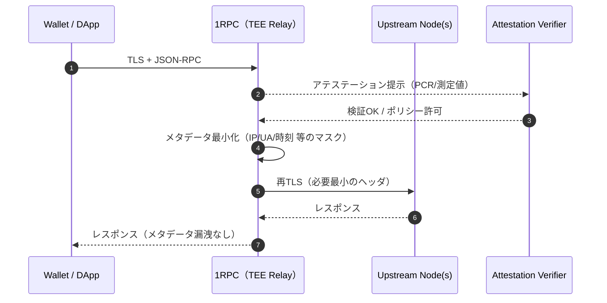

---

<!-- textlint-disable -->

## Part 2：Automata 1RPC / Unichain（Flashblocks）徹底解説

> 本記事は **Part 2**。TEE の基礎は Part 1 を参照。  
> ここでは **Automata 1RPC** と **Unichain（Rollup-Boost/Flashblocks）** を、ブロックチェーン未経験の読者にも分かるように分解します。

## 0. ざっくり要約

- **Automata 1RPC**：TEE を用いて **クライアントのメタデータ（IP/UA/時刻等）を TEE 内で最小化**し、安全に複数チェーンへリレーする設計。
- **Unichain（Flashblocks）**：**TEE 内ブロックビルド**＋**200–250ms サブブロック**で、UX（高速）と**順序の検証可能性**を両立。MEV 公平性や revert-protection に寄与。

---

## 1. 前提：ブロックチェーン超入門（最短版）

- **L1 / L2**：L2 は L1（例：Ethereum）に最終性やデータ可用性を寄せ、**コスト/速度/UX**を最適化する実装（Optimistic/ZK 等）
- **Sequencer**：L2 で Tx を**順序付けて**ブロックにまとめる役
- **Block Builder**：Tx を選別・並べ替え・バンドル化（MEV の論点が絡む）
- **MEV（Maximal Extractable Value）**：注文の並びや含め方によって生じる価値。**フロントラン／サンドイッチ**が代表例

---

## 2. Automata 1RPC：プライバシー重視の RPC リレー

### 2.1 問題設定

- 通常の RPC では、**IP・UA・時刻・位置情報のヒント**などが **相手ノードや中継事業者に露出**し得る。
- とくにウォレットやアプリの初期化・署名要求・残高照会などは、**行動履歴の推測**につながる。

### 2.2 1RPC の基本設計

TEE（SGX/TDX/Nitro 等）内でマスキング・正規化・最小化を実施

アテステーション検証を通すことで、クライアントは「期待した測定値の TEE 内で処理」を確認

マルチチェーン対応：1 エンドポイントで複数ネットワークにリレー（内部で振り分け）

### 2.3 メタデータ最小化の具体例

削除：グローバル IP、XFF、詳細 UA 文字列、細粒度のタイムスタンプ

正規化：UA を大分類（OS/ブラウザのメジャー系列）だけに

パディング：リクエスト長・タイミングに一定の揺らぎを入れる（観測耐性）

実装上の勘所：監査ログは TEE 外に出る。何を残すか（匿名化・集約）を事前に設計。

### 2.4 信頼と限界

1RPC は TEE の信頼に依存。サイドチャネルや TCB のアップデートに伴う再アテステーションが前提。

「誰が検証するか？」——自前検証（ウォレット・ゲートウェイ）／外部のアテステーション・レジストリ活用など。

## 3. Unichain（Rollup-Boost / Flashblocks）：TEE ブロックビルド

### 3.1 何が新しい？

Sequencer-Builder 分離の文脈で、Block Builder を TEE 内で動かす。

200–250ms のサブブロック（Flashblocks）を TEE 内で作り、1 秒ブロックを構成。

効果：低レイテンシ UX と順序の検証可能性（透明なルール＋アテステーション）を両立。

### 3.2 どんな「公正さ」が担保される？

ルールの公開性：優先度（例：手数料／タイムスタンプの扱い等）を検証可能に

TEE のアテステーション：Builder バイナリと設定の**測定値（PCR）**で同一性を担保

再現性：同一入力 → 同一サブブロック（ルールに従う限り）

### 3.3 UVN（検証ネットワーク）・再最終性

サブ秒の操作可能最終性（操作が巻き戻らない見込み）と、経済的最終性は別概念。

L1 への投稿・フォールト証明の流れと合わせ、ユーザ体験上の確度を上げる。

### 3.4 脅威モデルと限界

TEE 依存：サイドチャネル・マイクロコード・ファームウェア更新のリスク

観測耐性：サブブロック窓に合わせたタイミング推測（流量調整・バッチング工夫が必要）

実装進化中：仕様は継続更新されるため、断定表現を避ける／アテステーション公開を前提にする

## 4. 開発者向けチェックリスト（1RPC / Unichain）

アテステーション検証：誰がどのポリシーで検証するか（ウォレット／ゲートウェイ／コントラクト）

測定値の公開：PCR セット、ビルド ID、コミットハッシュのディスクロージャ

プライバシーモデル：メタデータの最小化ルール、匿名化、保持期間

監査ログ：外部から個人再識別できないレベルでの観測に限定

フォールト処理：アテステーション失敗時のフェイルクローズ、代替経路

## 5. よくある質問（抜粋）

Q. 1RPC を通してもノード側に何か漏れない？
A. 1RPC 側の TEE で最小化・正規化した後に送る。ポリシーの公開とアテステーション検証が鍵。

Q. Flashblocks の 200–250ms は固定？
A. 実装・ネットワーク条件で最適値は変わり得る。目標レイテンシ帯と理解し、将来調整される可能性あり。

Q. ZK と競合する？
A. 競合ではなく補完。ZK は暗号学的検証、TEE は実時間処理と汎用性に強み。

参考リンク（一次・準一次情報）

1RPC（Overview / Docs）: <https://1rpc.io/>
/ <https://docs.1rpc.io/>

Flashbots：Rollup-Boost / Unichain Mainnet 記事

<https://writings.flashbots.net/introducing-rollup-boost>

<https://writings.flashbots.net/unichain-mainnet>

TEE 比較（ZK vs TEE の観点）: <https://oasis.net/blog/comparing-zkp-tee-privacy>

Nitro Enclaves（測定値の概説）: <https://docs.ata.network/pom/attestation-module/machine-attestation/aws-nitro-enclaves>

付録：用語集（Sequencer / Builder / MEV / 最終性 / DA / PCR / DCAP など）は必要があれば追記します。

<!-- textlint-enable -->
