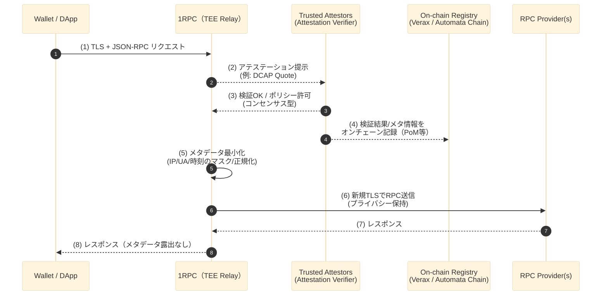
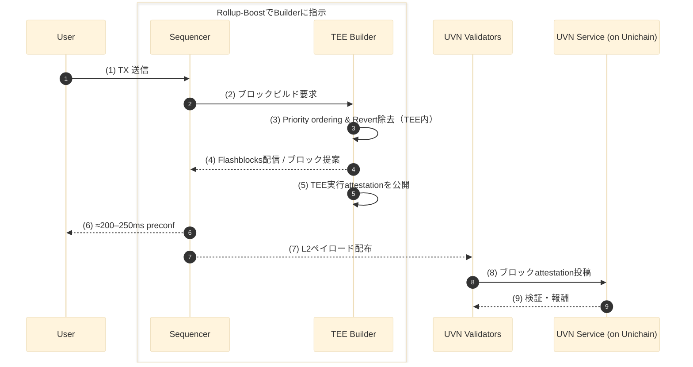

TEE とは、[前回のTEE（Trusted Execution Environment）入門[基礎編]で解説](https://zenn.dev/omakase/articles/afcd9b34500eec)したとおり、OS や root でもアクセス不可能なハードウェアレベルの隔離領域を作り、機密データの保管、暗号演算や認証処理、証明書付きの起動検証を安全に行う仕組みのことです。
今回の記事では、ブロックチェーンに応用した例として、**Automata 1RPC** と **Unichain（Rollup-Boost/Flashblocks）** について、その仕組みを解説します。

---

## 1. Automata 1RPC：プライバシー重視の RPC リレー

### 1.1 既存のRPCの役割と問題点

- 通常の RPC では、IP アドレスやウォレットアドレスなどが RPC プロバイダに収集されるリスクがある点を記述する。
- 仮に IP アドレスとウォレットアドレスの紐づけ情報がハッカーに漏洩した場合、攻撃の対象となってしまうリスクが高まるなどの危険性を記述する。
- 自身でフルノードを構築して自前の RPC でブロックチェーンにアクセス可能だが、コスト面や技術的難易度から現実的ではない点を記述する。

### 1.2 1RPC のアーキテクチャ ※この章は原文案

**Automata 1RPC とは、クライアントより送られた TX リクエストからメタデータ（IP/UA/時刻等）をフィルタリングしてRPC Providerにリクエストを受け渡すリレイヤーのことです。**

1. Wallet → 1RPC に接続
   クライアントは TLS で 1RPC に接続し、JSON-RPC を送ります。つまり、1RPC はクライアントと RPC providers の間に入る TEE プロキシです。

2. TEE がアテステーション提示
   1RPC の TEE は、ハード／ソフトの測定値（例：Intel DCAP の Quote など）を提示します。ここで「どのバイナリが、どんな設定で、どの TEE 上で動いているか」を示します。

3. Trusted Attestors が検証・許可
   **第三者の検証者集合（Trusted Attestors）**が、その測定値をポリシーに従って検証し、合否（許可／拒否）を TEE に返します。オンチェーンでのフル検証は高コストになりやすいため、まずオフチェーンで合意を取る段階です。

4. オンチェーン記録（PoM/レジストリ）
   検証結果や関連メタ情報は、オンチェーンのレジストリ（例：Verax、あるいは実装により Automata Chain 等）へ記録できます。これにより、第三者が後から検証可能になります。

5. TEE 内でメタデータ最小化
   IP / UA / タイミングなど、識別に使われやすい情報を TEE 内でマスク／正規化します。オペレータが保存しない、RPC providers にも渡さないことを前提に処理します。

6. TEE → RPC Provider に再 TLS で中継
   外部の RPC Provider(s) へは新しい TLS セッションでリクエストを転送します。プロバイダ側からは、最小化後の情報しか見えません。

7. Provider から TEE へ応答
   RPC Provider からのレスポンスを TEE が受け取ります。

8. TEE → Wallet へ返却（漏洩なし）
   受け取った結果をクライアントに返します。メタデータの露出は抑制されたままです。

### 1.3 TEEの限界

- 1RPC は TEE の信頼に依存。TEE 依存：サイドチャネル・マイクロコード・ファームウェア更新のリスクについて言及する。

- ビタリックも言及している PIR が将来的な解決になるかもという旨を言及する。
  <https://defire.jp/what-is-importance-of-pir/>
  <https://ethereum-magicians.org/t/a-maximally-simple-l1-privacy-roadmap/23459>

## 2. Unichain（Rollup-Boost / Flashblocks）：TEE ブロックビルド

### 2.1 なぜUnichainというL2が構築されたのか

- 既存の uniswap、L2 における課題点である流動性の断片化などについてできれば具体的な数字も交えながら触れる
- <https://docs.unichain.org/docs> で記載された内容に基づいて Unichain とは何かを概要説明する

### 2.2 Unichainのアーキテクチャ

- tx が処理されていくフロー図をもとに各処理に関して細かく説明していく
- 単一の OP sequencer が Rollup-Boost というサイドカーを使って外部 TEE Block Builder にブロック構築を外注している点を説明
- その TEE attestation を外部公開することで（現在は非公開っぽい）、正しいバイナリ・ロジックで実行されていることを担保している点を説明
- 単一 sequencer のブロック構築を UVN で検証することで分散化している点について述べる

### 2.3 Unichainの今後

- WhitePaper に掲載された以下の今後の実装可能性について言及する。

- UVN
  - 信頼性のある中立性：バリデーターはロールアップのメモリプールを監視し、トランザクションが適時に含まれていることを保証できる。
  - 投稿制限：BatchPoster 契約は、特定の証明ウェイトを要求してからブロックを含めることができ、これによりシーケンサーが特定のルールに従わないブロックを投稿する能力を効果的に制限しする。

- TEE Block Builder
  - 暗号化メモプール：ユーザーはトランザクションを暗号化でき、取引前のプライバシーを強化できる。
  - スケジュール済みトランザクション：TEE をプログラムし、ユーザーやスマートコントラクトが自動トランザクションを送信できるようにすることで、スケジュールされたアクションや定期的なアクションを実行可能。
  - TEE コプロセッサ：TEE により、スマートコントラクトがプライベートで検証可能な計算を要求できるようにする。

## 3. まとめ

参考リンク（一次・準一次情報）

<https://docs.ata.network/>
<https://docs.unichain.org/docs>
<https://writings.flashbots.net/introducing-rollup-boost>
<https://writings.flashbots.net/unichain-mainnet>
